# Instalación

> Es recomendable utilizar docker para implementar y configurar el entorno de desarrollo para laravel

## Instalar y configurar docker

1. Descargar el instalador de la página oficial [for developers](https://www.docker.com/get-started/)
2. Al terminar con la instalación reiniciar el equipo y aceptar los términos de docker.
3. Al aparecer el siguiente mensaje, evitar cerrarlo y abrir un powershell para ejecutar lo siguiente:
   
    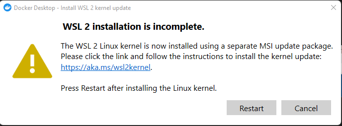

    ```wsl --set-default-version 2```

    Para desplegar las distribuciones linux que se pueden instalar

    ```wsl --list --online```

    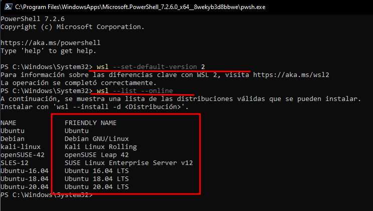


    Instalar con el siguiente comando, **sustituir por la distribución deseada**

    ```wsl --install -d <distribucion>```

4. Durante la instalacion se abrirá una ventana para colocar el usuario y contraseña del sistema linux.

    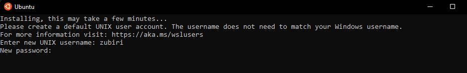

5. Una vez finalizado reiniciar la computadora.
    
---
## Primeros pasos

1. Abrir Powershell y ejecutar el comando ```wsl```

> **IMPORTANTE** Siempre que desde powershell se utilice el comando **wsl** al terminar de trabajar colocar un **wsl --shutdown** para que no siga consumiento ram

2. La subterminal que se abre es linux, se dirige a la ruta para empezar los proyectos. Por ejemplo, cd desktopp
3. Una vez en la ruta siempre que se desea crear un proyecto se coloca en la terminal:
   ```curl -s https://laravel.build/example-app | bash```

4. Durante la instalación se pide la contraseña linux para finalizar la creación del proyecto.

    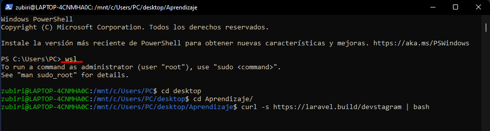

## Ejecutar los servicios de laravel
1. Desde wsl en powershell acceder a la ruta raiz del proyecto
2. Ejecutar ```./vendor/bin/sail up```
    > Lo anterior ejecuta todos los servicios de laravel en docker
3. Desde docker se verá el contenedor destinado a los componentes necesarios para laravel
   
   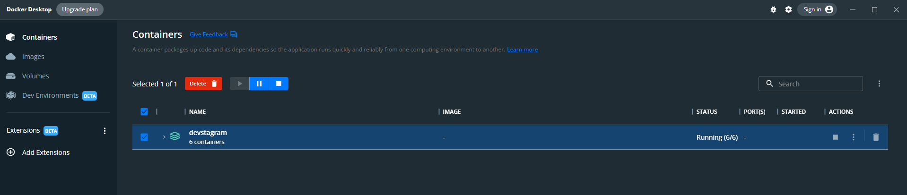
4. Desde los componentes podemos visualizar los puertos que estan siendo usados para los servicios:
   
   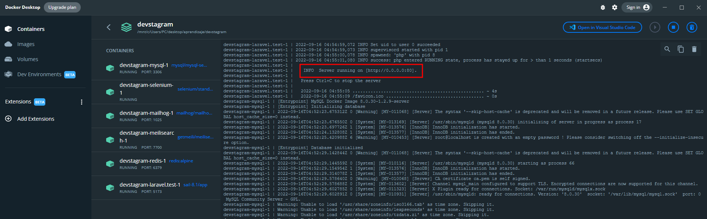

5. Desde el navegador accedemos en este caso a ```localhost:80```
   
   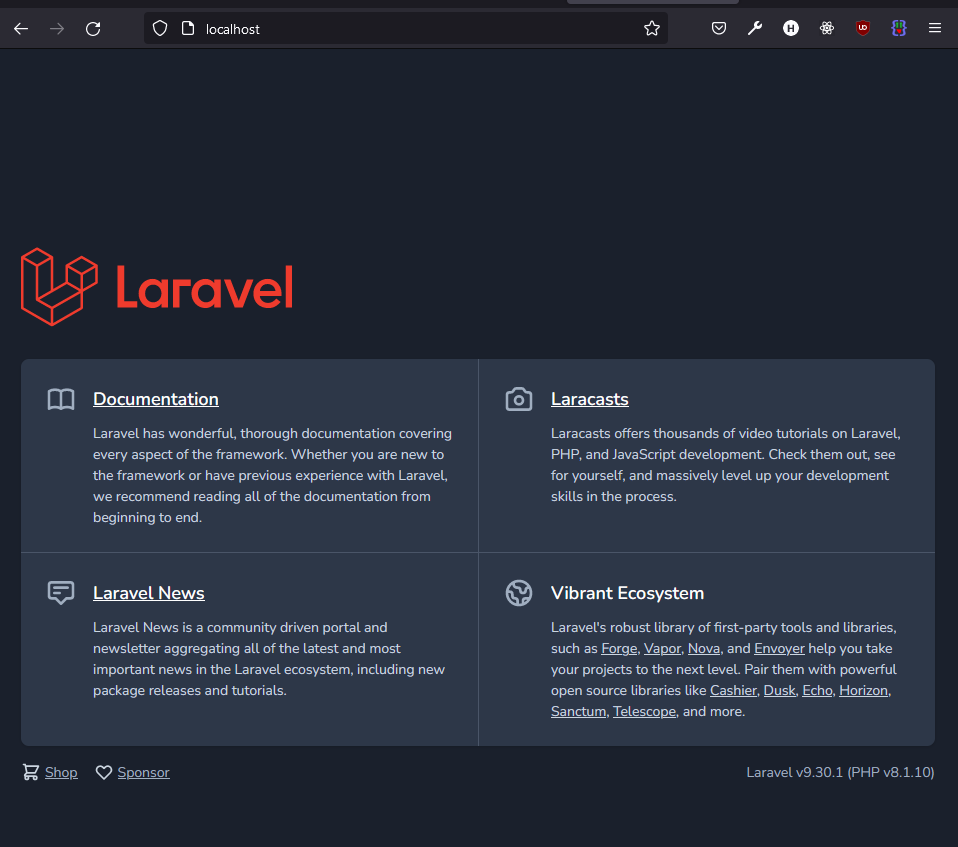
## Detener los servicios de laravel
1. Ejecutar ```./vendor/bin/sail down``` desde la raiz del proyecto en un powershell 
   
Alternativa:
1. Acceder a docker y detenerlo a través del contenedor correspondiente:
   
   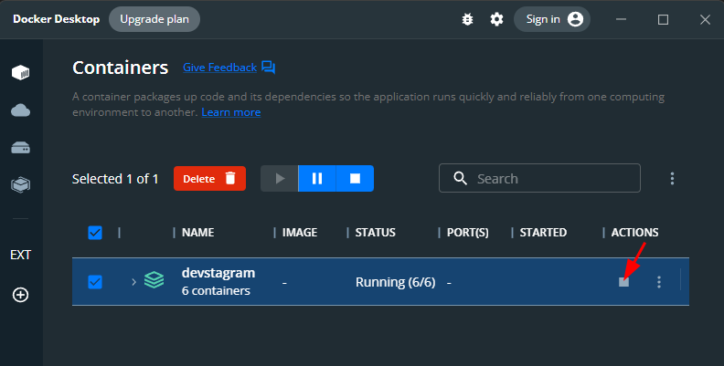

---
> Para evitar poner comandos tan largos se puede asignar un alias a la ruta vendor desde wsl:
    ```sudo nano ~/.bashrc```

1. Ir hasta la parte inferior con las flechas y dar enter, colocar lo siguiente: ```alias sail="./vendor/bin/sail"```
2. ctrl+o ctrl+m ctrl+x
3. Refrescar los cambios con: ```source ~/.bashrc```
4. Para verificar que funcionó ejecutar: ```alias```
   
   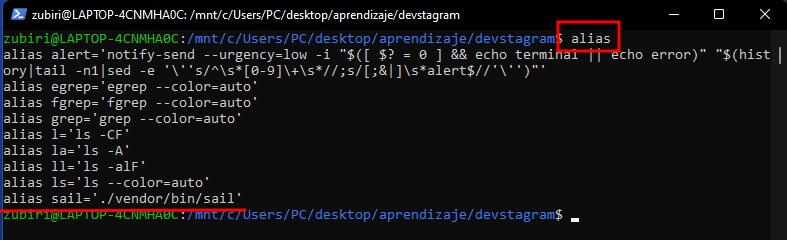
5. Para ejecutar o detener ahora solo sería ```sail up``` o ```sail down``` desde la raíz del proyecto.

---

## **Extensiones o modulos necesarios para PHP**
1. Visualizar informacion de php creando un archivo index.php
   ```php
   <?php
    phpinfo();
   ```
2. Ejecutarlo a traves de una terminal en la ruta correspondiente con el comando: ```php -S localhost:3000```
3. Acceder al localhost y visualizar la informacion de php:
   
    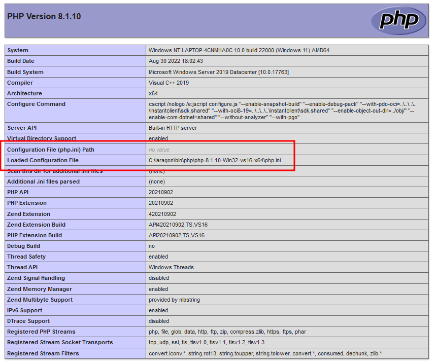  

4. Ir a la ruta de instalacion de PHP y abrir el archivo **php.ini**.
   
    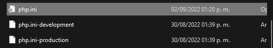
> El archivo puede ser reemplazado por el de produccion o desarrollo segun sea el caso, se crea una copia y renombra, al final la configuracion cargada es la que se encuentre en el php.ini

5. Las extensiones dentro del archivo se encuentran marcadas como **;extension**. Descomentar quitando el punto y coma a las siguientes:
- curl
- fileinfo
- gd
- mysqli
- pdo_mysql
- openssl

    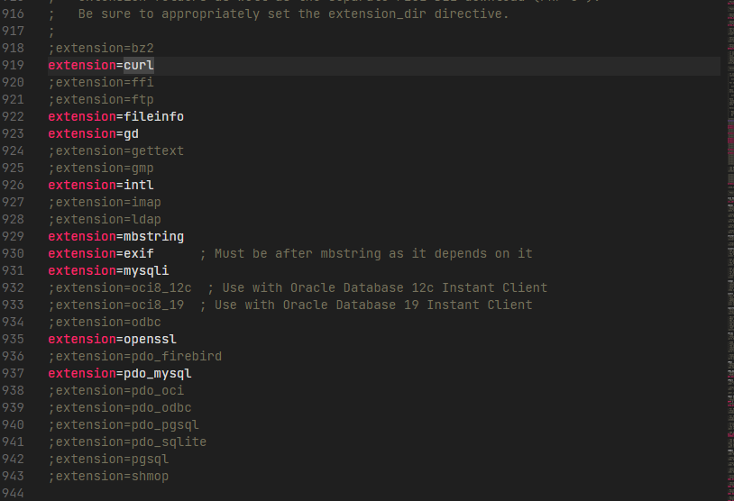

6. Reiniciar el servidor 

---

## **Instalar composer**
1. Descargar el instalador [Aquí>>>](https://getcomposer.org/)
2. La ruta de instalación debe apuntar al php.exe de la versión que se usa.
3. Desde powershell debe detectar el comando **composer**

## Otras instalaciones a tomar en cuenta
- Node y npm
- TablePlus
- MySQL

## **Crear proyecto nuevo con composer**
Desde powershell en la ruta deseada ejecutar
```composer create-project laravel/laravel myapp```