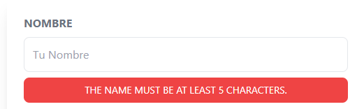

# Validar envío formulario


El post del formulario debe tener la validación en su controller:

```php
public function store(Request $request){
    // Validacion
    $this->validate($request,[
        'name' => 'required|min:5' // o bien ['required','min:5']
    ]);
}
```


Dentro del formulario crear una directiva:

```php
 <input
    id="name"
    name="name"
    type="text"
    placeholder="Tu Nombre"
    class="border p-3 w-full rounded-lg
    @error('name')
        border-red-500
    @enderror
    "
    value={{ old('name') }}
/>

@error('name')
    <p>{{ $message }}</p>
@enderror
```
> Laravel ya tiene mensajes dependiendo el error en las validacione



> Por defecto los errores en las validaciones vienen en inglés. En caso de necesitarlos en español se debe instalar un paquete desde un repositorio desde terceros:

## **Cambiar idioma mensajes de error validaciones**

[Laravel en español](https://github.com/MarcoGomesr/laravel-validation-en-espanol)

1. En la carpeta **resources** crear carpeta **lang**
2. Abrir una terminal y desde la raiz del proyecto:
   ```git clone https://github.com/MarcoGomesr/laravel-validation-en-espanol.git resources/lang/es```

3. Desde la carpeta **config** acceder a **app.php** y modificar:
   
```php
    //Buscar y editar por español
    'locale' => 'es',
```